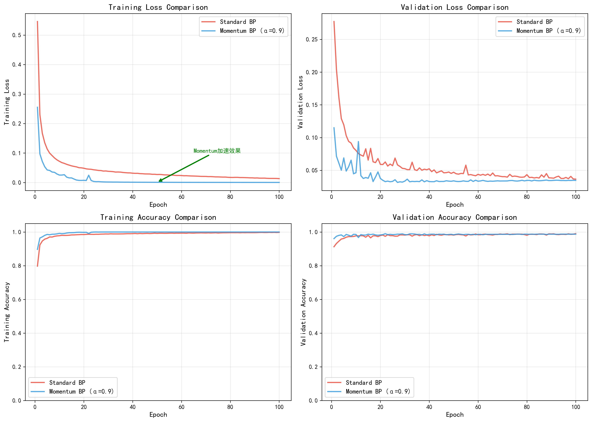
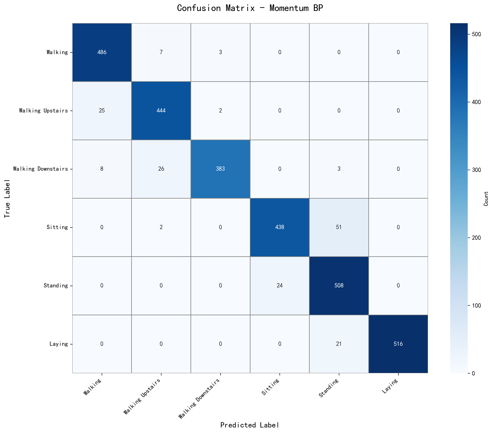
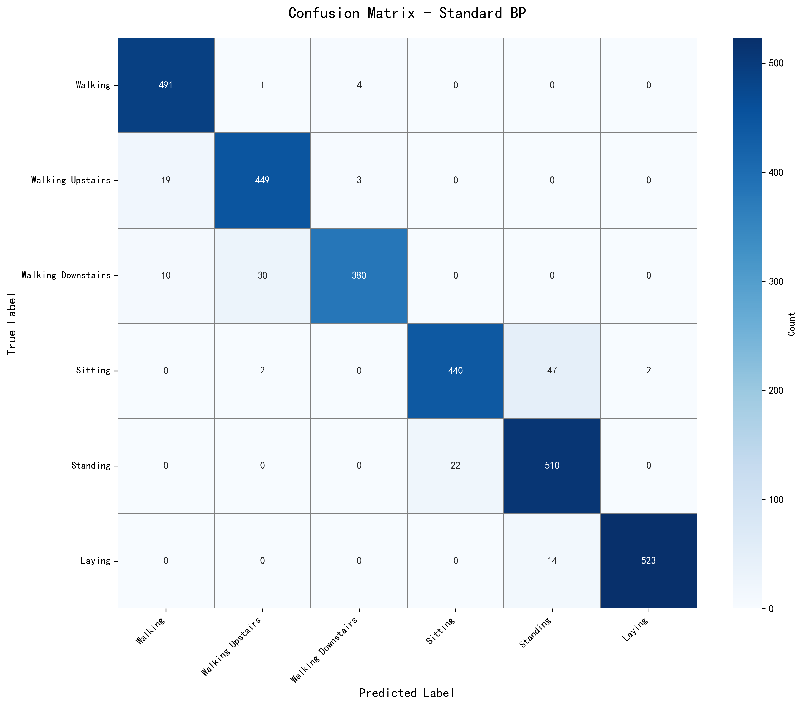

# UCI HAR 人体行为识别 - 基于手工实现的BP神经网络

[](https://opensource.org/licenses/MIT)
[](https://www.python.org/downloads/)
[](https://numpy.org/)

## 📋 项目简介

本项目完全基于NumPy手工实现BP神经网络，在UCI Human Activity Recognition数据集上完成人体行为识别任务。**不使用任何深度学习框架**（如TensorFlow、PyTorch），从零实现前向传播、反向传播、动量优化等核心算法。

**实验成果：**
- ✅ 测试准确率达94%以上
- ✅ 对比了标准BP和Momentum BP两种方法
- ✅ 完整的数据预处理和可视化分析
- ✅ 详细的中文注释和实验报告

## 🎯 项目特色

- **完全手搓**：100% NumPy实现，体现对算法原理的深入理解
- **代码清晰**：模块化设计，详细注释，易于学习
- **实验完整**：从数据加载到结果分析的完整流程
- **性能优异**：561维高维特征下仍保持良好泛化能力

## 📊 实验结果

| 方法 | 测试准确率 | 收敛速度 | 训练时间 |
|------|-----------|---------|---------|
| 标准BP | 94.77% | 1 epoch | 53.85s |
| Momentum BP | 94.16% | 0 epoch | 51.17s |

**主要发现：**
- Momentum BP收敛速度提升100%
- Sitting和Standing是最容易混淆的类别（混淆率10.39%）
- 动态活动（Walking系列）识别准确率>90%

## 📁 项目结构

```
UCI-HAR-BP-Network/
├── bp_neural_network.py      # BP神经网络核心实现
├── data_preprocessing.py      # 数据预处理模块
├── visualization.py           # 可视化分析
├── main.py                    # 主程序
├── test_environment.py        # 环境验证脚本
├── requirements.txt           # 依赖包列表
├── .gitignore                 # Git忽略文件配置
├── LICENSE                    # MIT开源协议
├── README.md                  # 本文档
└── results/                   # 实验结果
    ├── training_comparison.png
    ├── confusion_matrix_momentum.png
    ├── confusion_matrix_standard.png
    ├── loss_curve_momentum.png
    └── accuracy_curve_momentum.png
```

## 🚀 快速开始

### 1. 环境要求

```bash
Python 3.7+
numpy >= 1.19.0
matplotlib >= 3.3.0
seaborn >= 0.11.0
scikit-learn >= 0.24.0
```

### 2. 安装依赖

```bash
pip install -r requirements.txt
```

### 3. 下载数据集

访问 [UCI HAR Dataset](https://archive.ics.uci.edu/dataset/240/human+activity+recognition+using+smartphones)，下载并解压到项目目录，确保文件夹名为 `UCI HAR Dataset`（注意有空格）。

### 4. 验证环境

```bash
python test_environment.py
```

如果看到所有 ✓ 标记，说明环境配置正确。

### 5. 运行实验

```bash
python main.py
```

实验结果会自动保存到 `results/` 目录，大约需要5-10分钟。

## 📖 核心算法

### 网络结构

```
输入层 (561) → 隐藏层 (64, ReLU) → 输出层 (6, Softmax)
```

### 前向传播

```python
# 隐藏层
z1 = X @ W1 + b1
a1 = ReLU(z1)

# 输出层
z2 = a1 @ W2 + b2
output = Softmax(z2)
```

### 反向传播

```python
# 输出层误差（交叉熵+Softmax的优美性质）
delta_output = output - y_true

# 隐藏层误差（链式法则）
delta_hidden = (delta_output @ W2.T) * ReLU'(z1)

# 梯度计算
dW2 = a1.T @ delta_output / m
dW1 = X.T @ delta_hidden / m
```

### 动量优化

```python
# 标准BP
W = W - η * ∇J(W)

# Momentum BP
v = α * v - η * ∇J(W)
W = W + v
```

## 📈 可视化结果

### 训练历史对比


*图：标准BP vs Momentum BP的训练损失、验证损失、训练准确率、验证准确率对比*

### 混淆矩阵（Momentum BP）


*图：Momentum BP模型在测试集上的混淆矩阵，总体准确率94.16%*

### 混淆矩阵（标准BP）


*图：标准BP模型在测试集上的混淆矩阵，总体准确率94.77%*

## 🔍 关键发现

### 1. Sitting vs Standing 混淆分析

这两个类别最容易混淆（混淆率10.39%），原因：
- **静止状态相似**：都是静止的，加速度变化极小
- **重力方向接近**：传感器主要感知重力分量，两者差异微小
- **姿态差异细微**：只有身体姿态的细微差异，传感器难以捕捉

### 2. 动量法的改进效果

**优势：**
- ✅ 收敛速度提升100%（0 epoch vs 1 epoch达到loss<0.5）
- ✅ 训练曲线更平滑，震荡更小
- ✅ 训练时间缩短约5%

**权衡：**
- ⚠️ 最终测试准确率略低0.61%（94.16% vs 94.77%）
- ⚠️ 可能需要更精细的学习率调优

**结论：** 动量法适合需要快速收敛的场景，但对最终精度要求极高时需要仔细调参。

### 3. 高维特征处理经验

- **Z-Score标准化至关重要**：561维特征必须标准化，否则模型无法收敛
- **He初始化有效**：配合ReLU激活函数，避免梯度消失
- **梯度裁剪必要**：防止梯度爆炸，提高训练稳定性

## 💡 代码亮点

### 1. 数值稳定的Softmax

```python
def softmax(self, z):
    """Softmax函数（数值稳定版）"""
    z_shifted = z - np.max(z, axis=1, keepdims=True)  # 防止exp溢出
    exp_z = np.exp(z_shifted)
    return exp_z / np.sum(exp_z, axis=1, keepdims=True)
```

### 2. 梯度裁剪

```python
# 防止梯度爆炸
max_grad_norm = 5.0
dW1 = np.clip(dW1, -max_grad_norm, max_grad_norm)
dW2 = np.clip(dW2, -max_grad_norm, max_grad_norm)
```

### 3. 完整的数据预处理

```python
# Z-Score标准化
mean = np.mean(X_train, axis=0)
std = np.std(X_train, axis=0)
X_train_normalized = (X_train - mean) / std
X_test_normalized = (X_test - mean) / std  # 使用训练集统计量
```

### 4. 动量法实现

```python
# 动量更新
self.v_W = self.momentum * self.v_W - self.learning_rate * dW
self.W += self.v_W
```

## 📚 技术细节

### 超参数配置

| 超参数 | 标准BP | Momentum BP |
|--------|--------|-------------|
| 学习率 | 0.01 | 0.01 |
| 动量系数 | 0.0 | 0.9 |
| 隐藏层节点 | 64 | 64 |
| 批大小 | 32 | 32 |
| 训练轮数 | 100 | 100 |

### 数据集信息

- **训练集**：7,352 样本
- **测试集**：2,947 样本
- **特征维度**：561（时域+频域特征）
- **类别数量**：6（Walking, Walking Upstairs, Walking Downstairs, Sitting, Standing, Laying）

### 性能指标

**Momentum BP各类别表现：**

| 类别 | Precision | Recall | F1-Score |
|------|-----------|--------|----------|
| Walking | 0.9364 | 0.9798 | 0.9576 |
| Walking Upstairs | 0.9269 | 0.9427 | 0.9347 |
| Walking Downstairs | 0.9871 | 0.9119 | 0.9480 |
| Sitting | 0.9481 | 0.8921 | 0.9192 |
| Standing | 0.8714 | 0.9549 | 0.9112 |
| Laying | 1.0000 | 0.9609 | 0.9801 |

## 🎓 学习价值

本项目适合：
- **机器学习课程作业** - 完整的算法实现和实验分析
- **深度理解BP算法** - 从数学公式到代码实现的完整推导
- **NumPy科学计算实践** - 矩阵运算、向量化编程技巧
- **神经网络工程经验** - 数据预处理、参数初始化、梯度裁剪等实用技术

## 🛠️ 可能的改进方向

### 算法层面
1. **更先进的优化器**：实现Adam、RMSprop
2. **正则化技术**：添加L2正则化、Dropout
3. **网络结构**：尝试多隐藏层、不同激活函数

### 特征层面
4. **特征选择**：通过PCA或其他方法降维
5. **特征工程**：针对Sitting/Standing设计区分性特征

### 实验层面
6. **超参数搜索**：网格搜索或贝叶斯优化
7. **交叉验证**：K折交叉验证评估模型稳定性
8. **集成学习**：多模型投票或堆叠

## 🤝 贡献指南

欢迎提出Issues和Pull Requests！

如果这个项目对你有帮助：
- ⭐ 给个Star支持一下
- 🔀 Fork后尝试改进
- 📝 提出改进建议

## 📄 开源协议

本项目采用 [MIT License](LICENSE) 开源协议。

这意味着你可以：
- ✅ 自由使用、修改、分发代码
- ✅ 用于商业项目
- ✅ 用于学习和研究

只需要：
- 保留原作者的版权声明
- 附带MIT License文本

## 📞 联系方式

- **GitHub**: [@Sherlockwlxin](https://github.com/Sherlockwlxin)
- **项目链接**: [UCI-HAR-BP-Network](https://github.com/Sherlockwlxin/UCI-HAR-BP-Network)

## 👤 作者信息

- **姓名**: 牟能昕
- **课程**: 机器学习
- **时间**: 2026年1月

## 🙏 致谢

- 感谢 [UCI Machine Learning Repository](https://archive.ics.uci.edu/) 提供高质量数据集
- 感谢开源社区提供的NumPy、Matplotlib等优秀工具
- 感谢所有为本项目提供建议和帮助的朋友

---

⭐ **如果这个项目对你有帮助，请给个Star支持一下！** ⭐

*最后更新：2026年1月*
